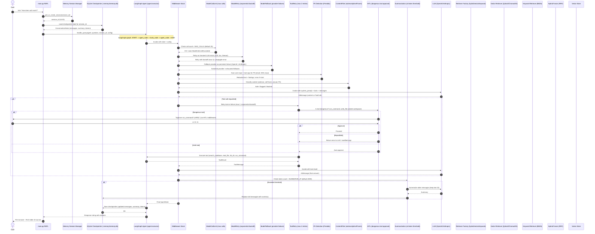
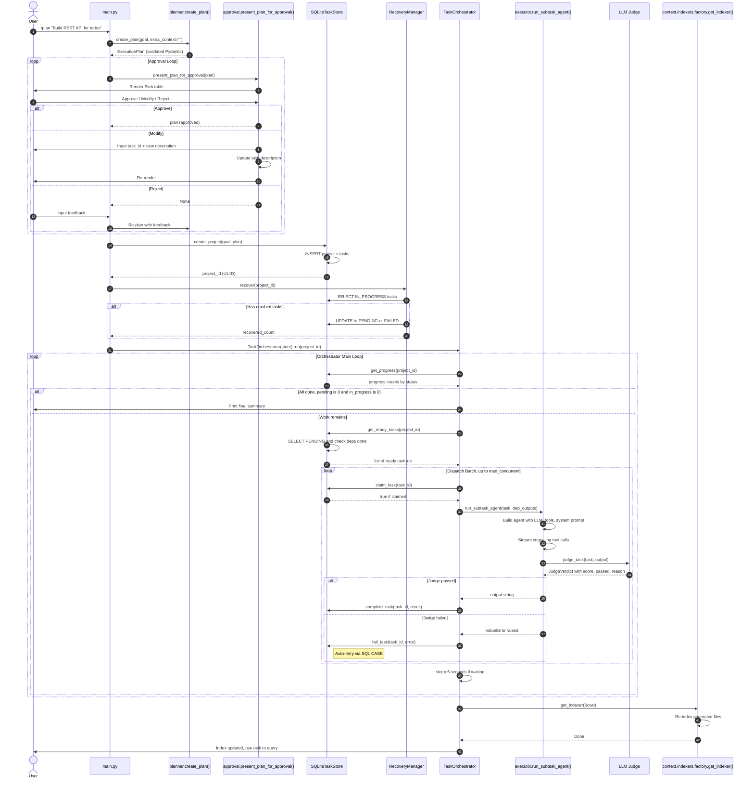
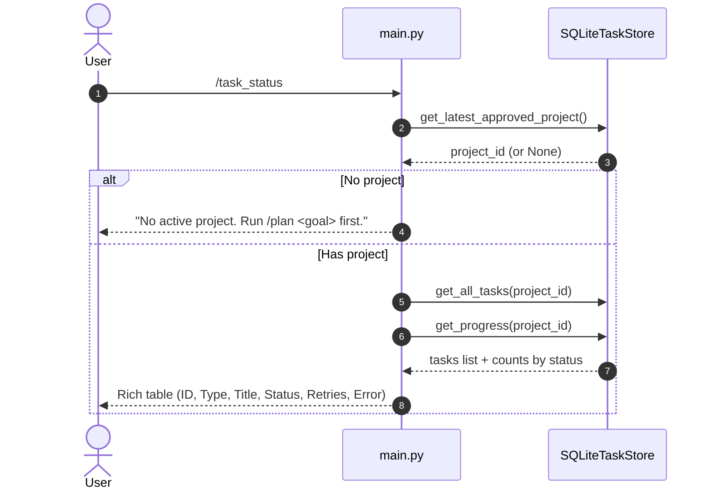
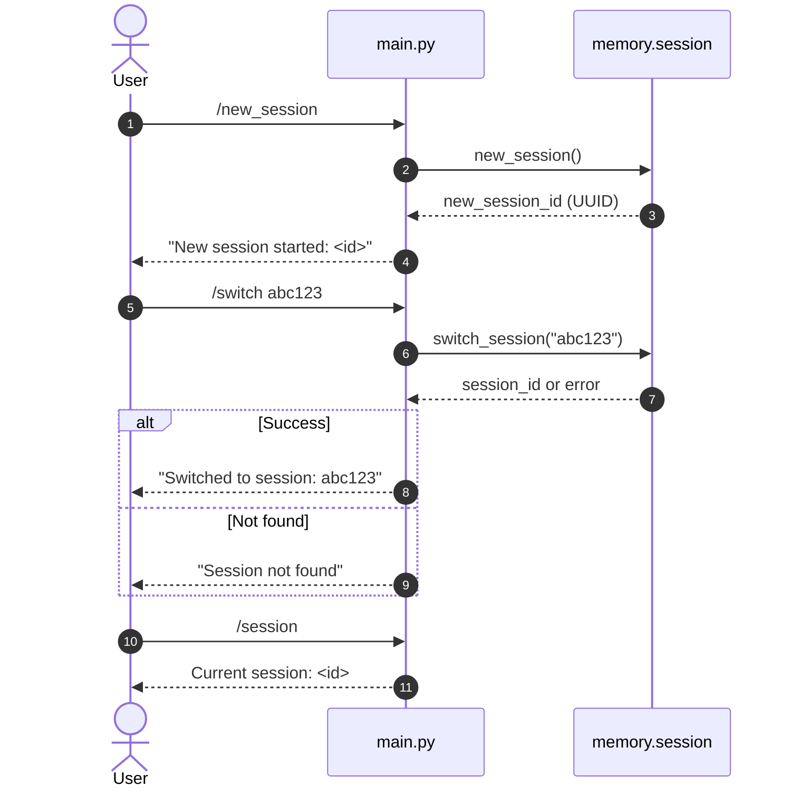
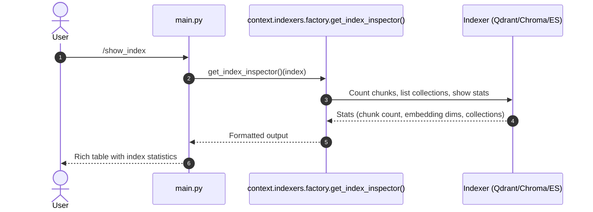
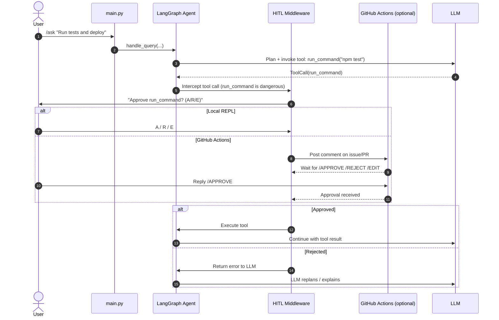

# 🚀 Radha Claude Code

[](https://www.python.org/downloads/)
[](https://python-poetry.org/)
[](https://opensource.org/licenses/MIT)
[](https://github.com/psf/black)

A sophisticated, modular code assistant powered by Retrieval-Augmented Generation (RAG) that enables natural language querying of codebases. Built with advanced language models, flexible indexing strategies, and persistent session management for seamless developer productivity.

## ✨ Key Features

- **🧠 Advanced Language Understanding**: Leverages state-of-the-art LLMs (OpenAI/Anthropic) for contextual code comprehension
- **🔍 Flexible Retrieval Strategies**: Hybrid, vector, and keyword-based search with pluggable backends (ChromaDB, Qdrant, Elasticsearch)
- **⚙️ Highly Configurable**: YAML-driven architecture allowing easy customization of models, providers, and retrieval modes
- **💾 Persistent Session Management**: SQLite-based checkpointer with token-aware summarization for context retention
- **🔌 Extensible Tool System**: Plugin-based architecture for adding custom capabilities via MCP servers
- **📊 Observability Built-in**: Structured logging and monitoring for performance insights
- **💬 Interactive REPL**: Rich terminal interface with slash commands for intuitive interaction

## 🏗️ Architecture Overview

```
┌─────────────────┐    ┌──────────────────┐    ┌────────────────────┐
│   User Input    │───▶│   Query Handler  │───▶│   Agent Orchestrator │
└─────────────────┘    └──────────────────┘    └────────────────────┘
                              │                         │
                              ▼                         ▼
                     ┌──────────────────┐    ┌────────────────────┐
                     │   Retrieval Mode │    │   Memory System    │
                     │ (Hybrid/Vector/  │    │ (Short-term +      │
                     │  Keyword)        │    │  Session Mgmt)     │
                     └──────────────────┘    └────────────────────┘
                              │                         │
                              ▼                         ▼
                     ┌──────────────────┐    ┌────────────────────┐
                     │   Indexers       │    │   Response Gen     │
                     │ (ChromaDB/       │    │   (LLM-powered)    │
                     │  Qdrant/ES)      │    │                    │
                     └──────────────────┘    └────────────────────┘
                              │                         │
                              └───────────┬─────────────┘
                                          ▼
                                  ┌──────────────────┐
                                  │  Codebase Index  │
                                  │  (Vector Store)  │
                                  └──────────────────┘
```

## 📦 Installation

### Prerequisites
- Python 3.12 or higher
- [Poetry](https://python-poetry.org/) for dependency management
- API keys for your chosen LLM provider (OpenAI or Anthropic)

### Setup Instructions

1. **Clone the repository**
   ```bash
   git clone https://github.com/mohitladia/radha_claude_code.git
   cd radha_claude_code
   ```

2. **Install dependencies**
   ```bash
   poetry install
   ```

3. **Configure environment variables**
   Create a `.env` file in the project root:
   ```env
   OPENAI_API_KEY=your_openai_api_key_here
   # OR
   ANTHROPIC_API_KEY=your_anthropic_api_key_here
   ```

4. **Review and adjust configuration** (optional)
   Edit `educosys_claude/config.yaml` to customize:
   - LLM provider and model
   - Embedding provider and model
   - Retrieval mode (hybrid/vector/keyword)
   - Vector store provider (ChromaDB/Qdrant/Elasticsearch)
   - Memory settings

5. **Initialize the codebase index**
   The system automatically creates an index on first run, or you can trigger it manually:
   ```bash
   poetry run educosys_claude
   # Then use /show_index command in the REPL
   ```

#### Common Issues
- **Poetry not found**: Ensure Poetry is installed and added to your PATH (`curl -sSL https://install.python-poetry.org | python3 -`).
- **Missing API keys**: The assistant will fail to start if neither `OPENAI_API_KEY` nor `ANTHROPIC_API_KEY` is set. Verify your `.env` file is in the project root and loaded.
- **ChromaDB permission errors on Windows**: Make sure the `.\chromadb` directory is writable; run the terminal as Administrator or adjust folder permissions.
- **Elasticsearch connection refused**: Confirm Elasticsearch is running on `localhost:9200` or update the `url` in `config.yaml`.
- **Missing dependencies after `poetry install`**: Run `poetry lock --no-update` then `poetry install` again to resolve lock‑file conflicts.

## 🚀 Usage

Start the interactive assistant:
```bash
poetry run educosys_claude
```

### Available Commands

| Command | Description |
|---------|-------------|
| `/ask <question>` | Query the codebase using natural language |
| `/show_index` | Display all indexed code chunks and statistics |
| `/new_session` | Start a fresh conversation session |
| `/switch <session_id>` | Switch to an existing session by ID |
| `/session` | Show current session ID |
| `/exit` or `/quit` | Terminate the assistant |

### Example Workflow

```bash
> /ask How does the authentication system work in this codebase?
[dim]Searching for: How does the authentication system work in this codebase?...[/dim]
[Response generated based on indexed code]

> /new_session
[green]New session started: abc123[/green]

> /ask Explain the vector storage implementation
[dim]Searching for: Explain the vector storage implementation...[/dim]
[Response generated]

> /session
[dim]Current session: abc123[/dim]

> /switch def456
[green]Switched to session: def456[/green]
```

#### 📸 Screenshots / Demo

Below is a short animated demo of a typical `/ask` interaction:


*(If the image does not appear, the raw recording can be viewed at https://asciinema.org/a/xxxxxx)*

---

## 🔄 Sequence Diagrams

### `/ask <question>` — Query the Codebase



### `/plan <goal>` — Generate & Execute a Multi-Step Plan



### `/task_status` — View Task Progress



### Session Management — `/new_session`, `/switch`, `/session`



### `/show_index` — Inspect Vector Index



### HITL (Human-in-the-Loop) — Dangerous Tool Approval



---

## ⚙️ Configuration

All configuration is managed through `educosys_claude/config.yaml`:

```yaml
llm:
  provider: openai        # openai | anthropic
  model: gpt-4o

embeddings:
  provider: openai              
  model: text-embedding-3-small

chromadb:
  persist_dir: .chromadb/
  collection_name: codebase

elasticsearch:
  url: http://localhost:9200
  index_name: codebase

rag:
  mode: hybrid          # hybrid | vector | keyword

vector_store:
  provider: qdrant
  retrieval_mode: hybrid        # chromadb | elasticsearch | qdrant

qdrant:
  collection_name: ladiamohit

memory:
  db_path: .memory/memory.db
  summarize_at_tokens: 4000
  keep_last_messages: 20
```

### Configuration Reference Table

| Section | Key | Type | Default | Allowed Values | Description |
|---------|-----|------|---------|----------------|-------------|
| llm | provider | string | openai | openai, anthropic | LLM provider |
| llm | model | string | gpt-4o | provider‑specific | Model name |
| embeddings | provider | string | openai | openai, huggingface | Embedding provider |
| embeddings | model | string | text-embedding-3-small | provider‑specific | Embedding model name |
| chromadb | persist_dir | string | .chromadb/ | filesystem path | Persistence directory for ChromaDB |
| chromadb | collection_name | string | codebase | any string | Collection name in ChromaDB |
| elasticsearch | url | string | http://localhost:9200 | URL | Elasticsearch endpoint |
| elasticsearch | index_name | string | codebase | any string | Index name in Elasticsearch |
| rag | mode | string | hybrid | hybrid, vector, keyword | Retrieval mode |
| vector_store | provider | string | qdrant | chromadb, elasticsearch, qdrant | Vector store provider |
| vector_store | retrieval_mode | string | hybrid | chromadb, elasticsearch, qdrant | Retrieval mode for vector store |
| qdrant | collection_name | string | ladiamohit | any string | Collection name in Qdrant |
| memory | db_path | string | .memory/memory.db | filesystem path | SQLite database path for memory |
| memory | summarize_at_tokens | integer | 4000 | positive int | Token threshold to trigger summarization |
| memory | keep_last_messages | integer | 20 | positive int | Number of recent messages to keep after summarization |

### Supported Providers

- **LLM Providers**: OpenAI (`gpt-4o`, `gpt-4-turbo`, etc.), Anthropic (`claude-3-opus`, `claude-3-sonnet`, etc.)
- **Embedding Providers**: OpenAI (`text-embedding-3-small`, `text-embedding-3-large`), HuggingFace (`sentence-transformers/all-MiniLM-L6-v2`, etc.)
- **Vector Stores**: ChromaDB (local), Qdrant (local/cloud), Elasticsearch
- **Retrieval Modes**: 
  - `hybrid`: Combines vector similarity and keyword matching (BM25)
  - `vector`: Pure vector similarity search
  - `keyword`: Traditional text‑based search

## 🛡️ Guardrails Middleware

The agent includes built-in safety middleware configurable via `config.yaml`:

### PII Detection & Redaction (`PIIMiddleware`)
Detects and handles sensitive data in model inputs/outputs and tool calls:
- **Default patterns**: Email, US phone, SSN, credit cards, API keys (OpenAI, Anthropic, generic), AWS keys, GitHub tokens, IP addresses, JWT tokens
- **Actions**: `redact` (replace with `[REDACTED:TYPE]`), `block` (raise error), `log_only` (warn only)
- **Scope**: Apply to model input, model output, tool input, tool output independently

### Content Filter (`ContentFilterMiddleware`)
Blocks or flags prohibited content:
- **Default rules**: Violence, self-harm, illegal acts, PII requests, hate speech (log only), sexual content
- **Severity levels**: low, medium, high, critical — threshold controls enforcement
- **Actions**: `block` (raise error), `log_only` (warn only)

### Middleware Stack Order
The guardrails run in this order (inner to outer):
1. ModelCallLimit → 2. ModelRetry → 3. ModelFallback → 4. ToolRetry → **5. PIIMiddleware → 6. ContentFilterMiddleware** → 7. HITL → 8. Summarization

**Why this order?** PII redaction runs before content filter (prevents false positives from sensitive data), both run before HITL (clean data for human review), after retries (only process successful requests).

See [docs/GUARDRAILS_PACKAGE.md](docs/GUARDRAILS_PACKAGE.md) for full configuration and custom pattern examples.

## 🧪 Testing

### Unit Tests
Run the test suite with Poetry:
```bash
poetry install --with test
poetry run pytest
```

### End‑to‑End (E2E) Guide
To verify the full stack works end‑to‑end:

1. Start the assistant:
   ```bash
   poetry run educosys_claude
   ```
2. In the REPL, run a sample query:
   ```
   /ask How does the agent factory create the LangChain agent?
   ```
3. Verify the response includes file names, function names, and line numbers from the codebase.
4. Exit with `/exit`.

For automated CI you can script the REPL using `expect` or a similar tool, feeding a known question and asserting the output contains expected tokens (e.g., `factory.py`, `build_agent`).

## 🔌 Extending the Agent

### Adding Custom Tools
1. Create a new tool file under `educosys_claude/tools/` (e.g., `my_tool.py`).
2. Implement a function decorated with `@tool` from LangChain, returning a string.
3. Export the tool in `educosys_claude/agent/tools.py` by importing and adding it to the `TOOLS` list.
4. Restart the agent; the new tool will be available for the LLM to invoke.

### Adding MCP Servers
1. Define your MCP server configuration in `educosys_claude/mcp/educosys_mcp_config.py`.
2. Add the server name to the `mcp_servers` list in `config.yaml`.
3. Restart the agent; the server’s tools will be auto‑loaded.

### GitHub Actions Human-in-the-Loop (HITL)

The agent supports **Human-in-the-Loop approval** for dangerous tools (shell commands, file writes, GitHub API calls) in CI environments.

**Three Approaches:**

| Approach | Mechanism | Best For |
|----------|-----------|----------|
| Environment Protection | Workflow pauses at `environment: production` | Production deployments, compliance |
| Comment Polling (default) | Bot posts comment, polls for `/APPROVE`/`/REJECT`/`/EDIT` | General CI, standard `GITHUB_TOKEN` |
| GitHub Gist | Private gist stores state, polls for updates | Fork PRs, minimal permissions |

**Quick Start:**
```bash
# 1. Create workflow (copy from agent/hitl_github_actions.py __main__)
python -m educosys_claude.agent.hitl_github_actions > .github/workflows/agent.yml

# 2. Trigger via GitHub CLI
gh workflow run agent.yml -f question="Create a PR adding a README"
```

**Human Review:** Bot posts comment on tracking issue → Reviewer replies `/APPROVE` → Workflow resumes.

See [docs/HITL_GITHUB_ACTIONS.md](docs/HITL_GITHUB_ACTIONS.md) for full setup, configuration, and troubleshooting.

## 🚀 Usage Examples for Retrieval Modes

Set `rag.mode` in `config.yaml` and observe the differences:

- **hybrid** (default): Combines semantic similarity with keyword BM25 scores; returns ranked chunks with both scores shown.
- **vector**: Pure semantic search; good for conceptual queries; scores are cosine similarity.
- **keyword**: Pure BM25 text match; highlights exact term matches; useful for exact symbol or error‑message searches.

Example `/ask` outputs will display the chosen mode and scoring details in the returned chunks.

## ⚡ Performance & Tuning

- **Embedding Model Size**: Larger models (e.g., `text-embedding-3-large`) improve recall but increase storage and query latency.
- **Vector Store Choice**: Qdrant offers fast ANN search with filtering; ChromaDB is zero‑config for local dev; Elasticsearch scales well for large corpora.
- **Memory Settings**: Lower `summarize_at_tokens` to keep more recent context; increase `keep_last_messages` for longer dialogue memory.
- **Batch Indexing**: Adjust batch size in `context/indexers/*` if indexing large codebases; tune via environment variable `INDEX_BATCH_SIZE`.
- **Concurrent Queries**: The agent handles concurrent requests; tune `max_workers` in the agent factory if needed.

## 📜 Changelog

See [CHANGELOG.md](CHANGELOG.md) for detailed release notes.

### Latest Release (v0.4.0) – 2024-09-15
- Added Qdrant vector store support  
- Introduced hybrid retrieval mode  
- Improved session summarization latency  
- Fixed ChromaDB persistence on Windows  

## 🔒 Security Policy

Please report security vulnerabilities privately via email to security@radhacode.com. See [SECURITY.md](SECURITY.md) for details.

## ❓ FAQ

**Q: Can I use a local LLM (e.g., Ollama)?**  
A: The LLM factory currently supports OpenAI and Anthropic. Adding a local LLM requires extending `educosys_claude/llm/factory.py` – contributions welcome!

**Q: Where are session files stored?**  
A: Session data lives in the SQLite database at `.memory/memory.db` by default (configurable via `memory.db_path`).

**Q: How do I reset the vector index?**  
A: Delete the persistence directory (e.g., `.chromadb`, `.qdrant`, or the Elasticsearch index) and restart the assistant; it will re‑index on first query.

**Q: Does the tool support Windows?**  
A: Yes – all dependencies are cross‑platform. Ensure Poetry and a compatible Python 3.12+ are installed.

**Q: How can I contribute a new retrieval mode?**  
A: Implement a new retriever in `educosys_claude/context/retrievers/` and register it in `educosys_claude/context/retrievers/factory.py`. Update the `rag.mode` allowed values in the config schema.

## 📜 Code of Conduct

Please read our [CODE_OF_CONDUCT.md](CODE_OF_CONDUCT.md) to understand our community standards.

## 📞 Support

For questions, feedback, or support:
- Open an issue on GitHub
- Email: ladiamohit92@gmail.com
- Discussions: [GitHub Discussions](https://github.com/mohitladia/radha_claude_code/discussions)

## 🙏 Acknowledgments

- [LangChain](https://www.langchain.com/) for RAG foundations  
- [Rich](https://github.com/Textualize/rich) for beautiful terminal UI  
- [Poetry](https://python-poetry.org/) for dependency management  
- [OpenAI](https://openai.com/) and [Anthropic](https://www.anthropic.com/) for advanced language models  
- All contributors who have helped shape this project  

## 📚 API Reference

The core functionality is accessible through the `educosys_claude` package:

```python
from educosys_claude.main import run

# Start the assistant programmatically
run()
```

### Key Modules
- `educosys_claude.agent.factory` – Build and configure agents  
- `educosys_claude.context.indexers.factory` – Get indexer implementations  
- `educosys_claude.llm.factory` – Initialize LLM and embedding models  
- `educosys_claude.memory.session` – Manage user sessions  
- `educosys_claude.memory.short_term` – Handle conversation history  

---

**Radha Claude Code** – Making codebases understandable through intelligent interaction. 🚀

## 📚 Documentation

| Document | Description |
|----------|-------------|
| [docs/AGENT_PACKAGE.md](docs/AGENT_PACKAGE.md) | Agent factory, orchestrator, HITL middleware, GitHub Actions integration |
| [docs/MEMORY_PACKAGE.md](docs/MEMORY_PACKAGE.md) | Short-term (checkpointer, summarization) & Long-term (fact extraction) memory |
| [docs/MIDDLEWARE_PACKAGE.md](docs/MIDDLEWARE_PACKAGE.md) | 6-middleware stack: ModelCallLimit, ModelRetry, ModelFallback, ToolRetry, HITL, Summarization |
| [docs/TOOLS_PACKAGE.md](docs/TOOLS_PACKAGE.md) | Filesystem tools, terminal tools, HITL integration |
| [docs/GUARDRAILS_PACKAGE.md](docs/GUARDRAILS_PACKAGE.md) | PII detection/redaction and content filtering middleware |
