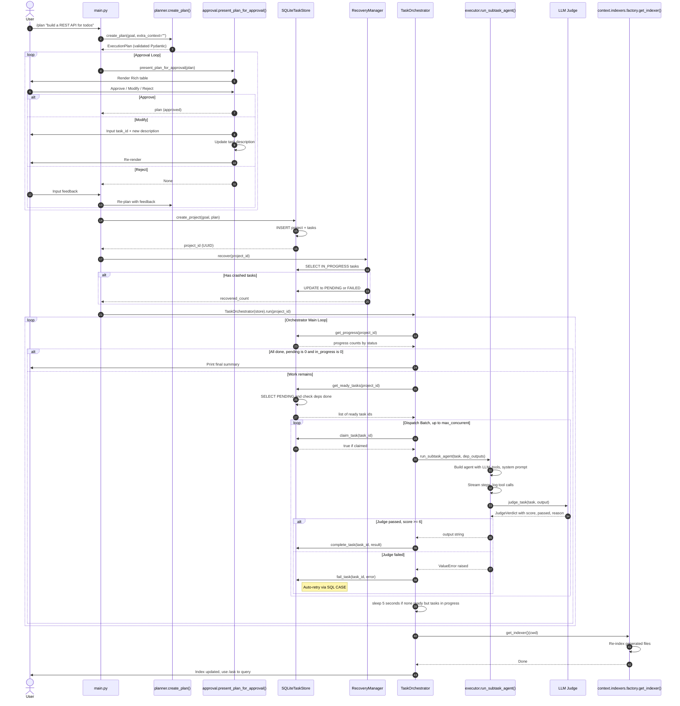

# `educosys_claude.tasks` Package — Detailed Architecture

**Task execution engine** — plans, persists, executes, and recovers multi-step AI-driven software projects.

Mirrors the `agent` package architecture: factory → orchestrator → executor → persistence → recovery → approval → status CLI.

---

## Package Layout

```
educosys_claude/tasks/
├── __init__.py           # public exports (see below)
├── orchestrator.py       # TaskOrchestrator.run() — main execution loop
├── planner.py            # LLM planner → ExecutionPlan (Pydantic) + human approval
├── executor.py           # run_subtask_agent() — per-task agent + LLM judge
├── task_store.py         # SQLiteTaskStore — persistence + atomic state machine
├── approval.py           # human-in-the-loop approval CLI (Rich tables)
├── recovery.py           # RecoveryManager — crash recovery (IN_PROGRESS → PENDING/FAILED)
├── status.py             # show_task_status() → Rich table CLI
├── TASKS_PACKAGE.md      # this file
└── __pycache__/
```

---

## 1. Public API (`__init__.py`)

```python
from .orchestrator import TaskOrchestrator, handle_plan_command
from .planner import create_plan, ExecutionPlan, PlannedTask
from .executor import run_subtask_agent
from .task_store import SQLiteTaskStore, TaskStatus, TaskType, Task
from .approval import present_plan_for_approval
from .recovery import RecoveryManager
from .status import show_task_status

__all__ = [
    "TaskOrchestrator", "handle_plan_command",
    "create_plan", "ExecutionPlan", "PlannedTask",
    "run_subtask_agent",
    "SQLiteTaskStore", "TaskStatus", "TaskType", "Task",
    "present_plan_for_approval",
    "RecoveryManager",
    "show_task_status",
]
```

---

## 2. Core Data Models (`task_store.py`)

### Enums

```python
class TaskStatus(str, Enum):
    PENDING     = "pending"
    IN_PROGRESS = "in_progress"
    COMPLETED   = "completed"
    FAILED      = "failed"
    BLOCKED     = "blocked"
    SKIPPED     = "skipped"

class TaskType(str, Enum):
    DESIGN    = "design"
    IMPLEMENT = "implement"
    TEST      = "test"
    REVIEW    = "review"
    INTEGRATE = "integrate"
    CONFIGURE = "configure"
```

### Task Dataclass

```python
@dataclass
class Task:
    id: str
    project_id: str
    title: str
    description: str
    task_type: str
    status: str               = TaskStatus.PENDING
    depends_on: str           = "[]"   # JSON list of task IDs
    output_files: str         = "[]"   # JSON list of file paths
    acceptance_criteria: str  = "[]"   # JSON list of criteria strings
    result: str | None        = None
    error: str | None         = None
    retry_count: int          = 0
    max_retries: int          = 3
    execution_order: int      = 0
    created_at: float         = field(default_factory=time.time)
    started_at: float | None  = None
    completed_at: float | None = None
```

### State Machine

```
PENDING ──claim──► IN_PROGRESS ──success──► COMPLETED (terminal)
                    │
                    ├─failure, retries left──► PENDING
                    ├─failure, no retries────► FAILED (terminal)
                    └─dep failed─────────────► BLOCKED (terminal)
SKIPPED (terminal — human explicitly skipped)
```

All transitions are **single atomic SQL UPDATE** with `WHERE status = 'expected'`.

---

## 3. Planner (`planner.py`)

### Output Models

```python
class PlannedTask(BaseModel):
    id: str                          # stable: task_001, task_002, ...
    title: str
    description: str
    task_type: TaskType
    depends_on: list[str]            # DAG edges
    estimated_minutes: int
    output_files: list[str]          # files this task will CREATE
    acceptance_criteria: list[str]   # 3-5 verifiable checks

class ExecutionPlan(BaseModel):
    project_name: str
    goal_summary: str
    tech_stack: list[str]
    total_estimated_hours: float
    tasks: list[PlannedTask]
    risks: list[str]
    assumptions: list[str]
```

### Planner Prompt Constraints (enforced by LLM)

| Rule | Detail |
|------|--------|
| Task count | 5–20 tasks |
| IDs | Stable snake_case: `task_001`, `task_002`… |
| Dependencies | Must reference valid task IDs in same plan; DAG (no cycles) |
| Ordering | Topological: architecture → schema → config → core → tests → integrate |
| Output files | Every file appears in exactly one task's `output_files` |
| Acceptance criteria | 3–5 concrete, verifiable checks per task |
| Task type | One of: design, implement, test, review, integrate, configure |

### Entry Point

```python
def create_plan(goal: str, extra_context: str = "") -> ExecutionPlan:
    """
    Calls LLM planner with system prompt + user goal.
    Returns validated ExecutionPlan (Pydantic).
    """
```

**Config used:** `config["llm"]["provider"]`, `config["llm"]["model"]`, `temperature=0`.

---

## 4. Human Approval (`approval.py`)

```python
def present_plan_for_approval(plan: ExecutionPlan) -> ExecutionPlan | None:
    """
    Renders plan as Rich table. Loops until user chooses:
      [A]pprove  → returns plan (unchanged or modified)
      [M]odify   → edit a single task description, re-render
      [R]eject   → returns None → caller re-plans with feedback
    """
```

**Table columns:** ID, Type, Title, Depends on, Output files
**Also shows:** project name, goal summary, tech stack, estimated hours, risks.

---

## 5. Persistence Layer (`task_store.py`)

### SQLite Schema

```sql
projects:
  id TEXT PRIMARY KEY,
  name TEXT NOT NULL,
  goal TEXT NOT NULL,
  plan_json TEXT,
  status TEXT DEFAULT 'planning',
  created_at REAL DEFAULT (unixepoch()),
  approved_at REAL

tasks:
  id TEXT PRIMARY KEY,
  project_id TEXT REFERENCES projects(id),
  title TEXT NOT NULL,
  description TEXT NOT NULL,
  task_type TEXT NOT NULL,
  status TEXT DEFAULT 'pending',
  depends_on TEXT DEFAULT '[]',
  output_files TEXT DEFAULT '[]',
  acceptance_criteria TEXT DEFAULT '[]',
  result TEXT,
  error TEXT,
  retry_count INTEGER DEFAULT 0,
  max_retries INTEGER DEFAULT 3,
  execution_order INTEGER DEFAULT 0,
  created_at REAL DEFAULT (unixepoch()),
  started_at REAL,
  completed_at REAL

INDEX idx_tasks_project ON tasks(project_id, status)
```

### Key Features

- **WAL mode** — crash-safe, concurrent reads during writes
- **Per-operation connections** — no shared long-lived connection
- **Atomic transitions** — single UPDATE with status check
- **Orphan detection** — any `IN_PROGRESS` at startup = crashed

### Critical Methods

```python
# Project
create_project(goal: str, plan: ExecutionPlan) -> str  # returns project_id
get_latest_approved_project() -> str | None

# Atomic state transitions
claim_task(task_id: str) -> bool          # PENDING → IN_PROGRESS
complete_task(task_id: str, result: str)  # IN_PROGRESS → COMPLETED
fail_task(task_id: str, error: str)       # IN_PROGRESS → PENDING (retry) or FAILED
block_task(task_id: str, reason: str)     # PENDING → BLOCKED

# Queries
get_ready_tasks(project_id: str) -> list[dict]   # PENDING + all deps COMPLETED/SKIPPED
get_all_tasks(project_id: str) -> list[dict]
get_progress(project_id: str) -> dict[str, int]  # count by status
get_dep_results(dep_ids: list[str]) -> list[dict]  # title + result for injection

# Dependency check
_all_deps_done(dep_ids) -> bool
```

### `get_ready_tasks()` Algorithm

```python
def get_ready_tasks(self, project_id: str) -> list[dict]:
    rows = SELECT * FROM tasks WHERE project_id=? AND status='pending' ORDER BY execution_order
    ready = []
    for row in rows:
        deps = json.loads(row["depends_on"])
        if self._all_deps_done(deps):  # all deps COMPLETED or SKIPPED
            ready.append(dict(row))
    return ready
```

---

## 6. Task Executor (`executor.py`)

### Per-Task Toolsets (Least Privilege)

```python
_TOOLS_BY_TYPE: dict[str, list] = {
    "design":    [read_file, write_file, list_directory],
    "implement": [read_file, write_file, append_file, list_directory],
    "test":      [read_file, write_file, append_file, list_directory, run_command],
    "review":    [read_file, write_file],
    "integrate": [read_file, write_file, append_file, list_directory, run_command],
    "configure": [read_file, write_file, list_directory, file_exists],
}
_DEFAULT_TOOLS = [read_file, write_file, list_directory]
```

### System Prompt Builder

```python
def _build_system_prompt(task: dict, dep_outputs: list[dict]) -> str:
    """
    Injects:
    - Task metadata (id, type, title, description)
    - Output files (bulleted)
    - Acceptance criteria (bulleted)
    - PRIOR TASK OUTPUTS — results from completed deps, giving agent memory
      without needing a shared checkpointer.
    """
```

### LLM-as-Judge Verification

```python
class _JudgeVerdict(BaseModel):
    passed: bool
    score: int      # 0-10
    reason: str

async def _judge_task(task: dict, agent_output: str) -> _JudgeVerdict:
    """
    Uses judge_model (cheaper) from config.
    Score ≥ 6 → passed=True
    """
```

**Judge prompt** includes task description, acceptance criteria, and agent output (truncated to 2000 chars).

### Main Entry Point

```python
async def run_subtask_agent(task: dict, dep_outputs: list[dict] | None = None) -> str:
    """
    1. Select toolset based on task_type (least privilege)
    2. Build system prompt with task details + dependency outputs
    3. Create LangChain agent with structured prompt
    4. Invoke with user message (task description + "directory may be empty" hint)
    5. Stream steps, logging tool calls for observability
    6. Extract final AIMessage content (handles reasoning models with empty final message)
    7. Run LLM judge against acceptance criteria
    8. If judge rejects (score < 6), raise ValueError → orchestrator retries
    9. Return agent output string on success
    """
```

**Config used:**
- `config["llm"]["provider"]`, `config["llm"]["model"]` — main agent
- `config["llm"].get("judge_model", model)` — judge (cheaper)

---

## 7. Orchestrator (`orchestrator.py`)

```python
class TaskOrchestrator:
    def __init__(self, store: SQLiteTaskStore, max_concurrent: int = 1):
        self.store = store
        self.max_concurrent = max_concurrent  # default 1 = serial

    async def run(self, project_id: str) -> None:
        """
        Main loop:
        1. Print progress (completed/total, in-progress, pending, failed)
        2. If pending==0 and in_progress==0 → done, print summary
        3. Get ready tasks (PENDING + all deps done)
        4. If none ready:
             - if in_progress > 0: wait 5s, continue
             - else: print warning, break
        5. Dispatch up to max_concurrent tasks in parallel
        6. Loop
        """

    async def _execute(self, task: dict) -> None:
        """
        1. claim_task() — atomic, returns False if already claimed
        2. Fetch dependency results
        3. await run_subtask_agent(task, dep_outputs)
        4. complete_task(result) OR fail_task(error) (auto-retry via SQL CASE)
        """
```

### Concurrency Control

- `max_concurrent=1` by default (serial, deterministic, cost-controlled)
- Increase for I/O-heavy tasks (e.g., `max_concurrent=3` for test/integrate phases)

---

## 8. Crash Recovery (`recovery.py`)

```python
class RecoveryManager:
    def __init__(self, store: SQLiteTaskStore):
        self.store = store

    def recover(self, project_id: str) -> int:
        """
        Finds all IN_PROGRESS tasks for project.
        Single-process serial execution ⇒ any IN_PROGRESS at startup = orphaned.
        For each:
          - retry_count < max_retries → reset to PENDING, retry_count += 1, error="CRASH: ..."
          - else → mark FAILED, error="CRASH: max retries exceeded"
        Returns count of tasks processed.
        """
```

**Called automatically** in `handle_plan_command()` before `orchestrator.run()`.

---

## 9. Status CLI (`status.py`)

```python
def show_task_status() -> None:
    """
    Finds latest approved project, prints Rich table:
    #, ID, Type, Title, Status (colored), Retries, Error (truncated)
    Also shows project ID and progress: completed/total
    """
```

**Output example:**

```
Project: 550e8400-e29b-41d4-a716-446655440000
Progress: 3/7 completed

#    ID          Type       Title                    Status       Retries  Error
1    task_001    design     Architecture spec        completed    0/3
2    task_002    implement  Database schema          in_progress  0/3
3    task_003    implement  Core models              pending      0/3
4    task_004    test       Unit tests               pending      0/3
5    task_005    review     Code review              pending      0/3
```

---

## 10. Main Entry Point (`main.py` wiring)

```python
# /plan <goal>
async def handle_plan_command(goal: str) -> None:
    store = SQLiteTaskStore(db_path)
    recover = RecoveryManager(store)

    project_id = store.get_latest_approved_project()
    if project_id:
        recover.recover(project_id)
    else:
        # plan → approve → persist
        while True:
            plan = create_plan(goal, extra_context)
            approved = present_plan_for_approval(plan)
            if approved: break
            extra_context = input("What should change? ")
        project_id = store.create_project(goal, approved)

    orchestrator = TaskOrchestrator(store, max_concurrent=1)
    await orchestrator.run(project_id)

    # Re-index generated files for /ask
    get_indexer()(str(Path.cwd()))
```

```python
# /task_status
def handle_status_command() -> None:
    show_task_status()
```

---

## 11. Configuration (`config.yaml`)

```yaml
tasks:
  db_path: ".educosys/tasks.db"

llm:
  provider: "anthropic"
  model: "claude-3-5-sonnet-20241022"
  judge_model: "claude-3-5-haiku-20241022"  # cheaper for judge
```

**Accessed via:** `config.get("tasks", {}).get("db_path", ".educosys/tasks.db")`

---

## 12. Sequence Diagram — `/plan` Flow



---

## 13. Adding a New Task Type

| Step | File | Change |
|------|------|--------|
| 1 | `task_store.py` | Add to `TaskType` enum |
| 2 | `executor.py` | Add entry to `_TOOLS_BY_TYPE` with appropriate toolset |
| 3 | `planner.py` | Update `_SYSTEM_PROMPT` with new type rules/constraints |
| 4 | `approval.py` | No change (renders `task_type.value` dynamically) |
| 5 | `status.py` | No change (renders `task_type` dynamically) |

**Example — adding `DEPLOY`:**

```python
# task_store.py
class TaskType(str, Enum):
    ...
    DEPLOY = "deploy"

# executor.py
_TOOLS_BY_TYPE = {
    ...
    "deploy": [read_file, write_file, list_directory, run_command],
}

# planner.py _SYSTEM_PROMPT add:
# - task_type must be one of: design, implement, test, review, integrate, configure, deploy
# - deploy tasks: output_files should be config/scripts, acceptance_criteria must include "deployed to <env> successfully"
```

---

## 14. Testing Strategy

### Unit Tests (suggested locations)

```
educosys_claude/tasks/tests/
├── test_task_store.py      # transitions, queries, recovery
├── test_planner.py         # ExecutionPlan validation, DAG checks
├── test_executor.py        # toolset selection, judge, empty output
├── test_orchestrator.py    # get_ready_tasks DAG logic, batch dispatch
└── test_recovery.py        # recover() with/without retries
```

### Key Test Cases

| Component | Tests |
|-----------|-------|
| `SQLiteTaskStore` | claim_task idempotency, fail_task retry logic, get_ready_tasks DAG, get_dep_results |
| `Planner` | ExecutionPlan validation, task_id format, DAG acyclicity |
| `Executor` | toolset per type, judge verdict parsing, empty output handling |
| `Orchestrator` | ready task selection, max_concurrent batching, progress loop exit |
| `Recovery` | crash recovery with/without retries left |

### Integration Test

```bash
# Dry-run a plan
/plan "create a hello world python script"

# Inspect DB
sqlite3 .educosys/tasks.db "SELECT * FROM tasks;"

# Check status
/task_status
```

---

## 15. Error Handling Patterns

| Scenario | Handling |
|----------|----------|
| Agent returns empty output | `ValueError("Agent returned empty output")` → retry |
| Judge score < 6 | `ValueError("Judge rejected...")` → retry (up to `max_retries`) |
| Tool call fails (file write, command) | LangChain agent surfaces as exception → caught in `_execute` → `fail_task` |
| Dependency failed | `get_ready_tasks` excludes (dep not COMPLETED/SKIPPED) → task stays PENDING → `block_task` called when dep fails |
| DB locked (concurrent) | SQLite timeout=10s, WAL mode reduces contention |
| Process crash mid-task | `IN_PROGRESS` at startup → `recovery.recover()` resets |

---

## 16. Observability

| Component | Logging |
|-----------|---------|
| `task_store` | `logger.info(f"Task {task_id} completed/failed")` |
| `executor` | Tool calls logged: `logger.info(f"Task {task_id} → tool calls: {...}")` |
| `judge` | `logger.info(f"Judge verdict for {task_id}: score={score}, passed={passed}")` |
| `orchestrator` | Progress printed to console every loop iteration |
| `recovery` | Console prints for each recovered task |

---

## 17. Extending the Package

### Custom Task Store (e.g., PostgreSQL)

Implement same interface:

```python
class PostgresTaskStore:
    def create_project(self, goal: str, plan: ExecutionPlan) -> str: ...
    def get_latest_approved_project(self) -> str | None: ...
    def claim_task(self, task_id: str) -> bool: ...
    def complete_task(self, task_id: str, result: str) -> None: ...
    def fail_task(self, task_id: str, error: str) -> None: ...
    def block_task(self, task_id: str, reason: str) -> None: ...
    def get_ready_tasks(self, project_id: str) -> list[dict]: ...
    def get_all_tasks(self, project_id: str) -> list[dict]: ...
    def get_progress(self, project_id: str) -> dict[str, int]: ...
    def get_dep_results(self, dep_ids: list[str]) -> list[dict]: ...
```

Then inject in `handle_plan_command()`.

### Custom Judge

Replace `_judge_task()` in `executor.py` with your own evaluator (e.g., pytest runner for test tasks, linter for review tasks).

---

## 18. File-Level Docstrings (for IDE hover)

Each module has a module-level docstring:

```python
# orchestrator.py
"""TaskOrchestrator — main execution loop for task DAGs."""

# planner.py
"""LLM planner: goal → ExecutionPlan (Pydantic) with human approval."""

# executor.py
"""run_subtask_agent — per-task agent with least-privilege tools + LLM judge."""

# task_store.py
"""SQLiteTaskStore — atomic persistence + DAG dependency resolution."""

# approval.py
"""Human-in-the-loop plan approval via Rich CLI."""

# recovery.py
"""RecoveryManager — crash-safe IN_PROGRESS reset."""

# status.py
"""show_task_status — Rich table CLI for /task_status."""
```

---

## 19. Related Packages

| Package | Relationship |
|---------|--------------|
| `educosys_claude.agent` | Mirror architecture; agents can be used as task executors |
| `educosys_claude.context` | Indexers/retrievers for `/ask` over generated code |
| `educosys_claude.memory` | Session/long-term memory (separate from task persistence) |
| `educosys_claude.tools` | Filesystem & terminal tools used by task agents |
| `educosys_claude.llm` | `init_chat_model` factory used by planner/executor/judge |
| `educosys_claude.config` | Central config access |

---

## 20. Quick Reference

| Task | Code |
|------|------|
| Run a plan | `/plan "your goal here"` |
| Check status | `/task_status` |
| Resume after crash | `/plan "same goal"` (auto-recovers) |
| Inspect DB | `sqlite3 .educosys/tasks.db` |
| View logs | Console output (Rich) + `logger` (file if configured) |
| Change concurrency | `TaskOrchestrator(store, max_concurrent=3)` |
| Use cheaper judge | Set `llm.judge_model` in `config.yaml` |
| Add task type | See §13 |
